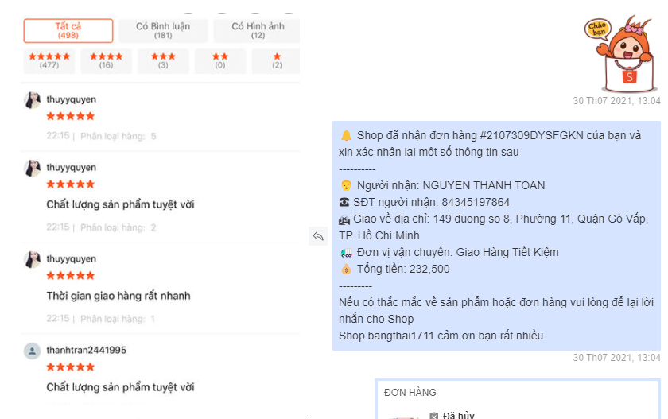

# 💡 Giới thiệu

.png>)

## 1) Quản lý tin nhắn đơn hàng nhiều Shop

Bạn có thể sử dụng **ShopManager** để quản lý tin nhắn & đơn hàng nhiều tài khoản **Shopee, Lazada, Tiki, Sendo** cùng một lúc.

* [x] Xử lý nhiều đơn hàng, nhiều Shop cùng một lúc
* [x] In đơn nhiều Shop cùng một lúc
* [x] Trả lời tin nhắn nhiều Shop cùn một màn hình
* [x] Theo dõi trạng thái đơn hàng của từng Shop trên cùng một màn hình
* [x] Theo dõi **đơn hoàn Shopee**
* [x] Hỗ trợ proxy tách riêng IP từng Shop
* [x] Đẩy sản phẩm nhiều Shop cùng một lúc


[quan-ly](shopmanager/quan-ly/)


## 2) Đồng bộ sản phẩm Shopee => Lazada, Sendo & TiktokShop

Bạn dễ dàng đồng sản phẩm từ Shopee sang các sàn **Lazada** hoặc **Sendo**

.png>)


[shopee-to-tiktok.md](autoshopee/sao-chep-da-san/tiktok/shopee-to-tiktok.md)



[shopee-to-lazada.md](autoshopee/sao-chep-da-san/lazada/shopee-to-lazada.md)



[Broken link](broken-reference)



[sao-chep-and-nhan-ban.md](shopmanager/san-pham/sao-chep-and-nhan-ban.md)


## 3) Xử lý đơn hàng hàng loạt

Xử lý đơn hàng (Chuẩn bị và In đơn) nhiều Shop và nhiều DVVC cùng một lúc, tối ưu việc xử lý và tiết kiệm thời gian


[chuan-bi-don-hang-loat.md](shopmanager/don-hang/chuan-bi-don-hang-loat.md)



[in-don-hang-loat.md](shopmanager/don-hang/in-don-hang-loat.md)



[doi-soat-hang-hoan.md](shopmanager/don-hang/doi-soat/doi-soat-hang-hoan.md)


## 4) Chăm sóc khách hàng

Chăm sóc khách hàng tự động sau bán hàng, nhắc nhở khách đánh giá đơn hàng. Tự động trả lời tin nhắn khách. Giúp tăng tỷ lệ khách hàng quay lại


[cham-soc-and-tra-loi-tu-dong.md](shopmanager/tu-dong/cham-soc-and-tra-loi-tu-dong.md)


## 5) Tăng tương tác lượt xem (View) Shopee

Bạn có thể sử dụng **Subcheo** để tăng tương tác lượt View cho Shop

<figure><figcaption></figcaption></figure>


[Broken link](broken-reference)


## 6) Siêu công cụ Extension cho trình duyệt

Bạn có thể sử dụng Extension cho Chrome & Firefox, để tải Video hoặc ảnh, sao chép bất kì sản phẩm trên Shopee

Tạo Flashsale, quét đánh giá sản phẩm

.png>)


[Broken link](broken-reference)


## \*) Mua - **G**ia hạn phần mềm

Bạn truy cập vào đây và làm theo hướng dẫn để mua phần mềm


Cổng thanh toán dịch vụ [https://payment.autoshopee.com](https://payment.autoshopee.com)


## \*)Liên hệ với chúng tôi

* **Youtube** [https://www.youtube.com/autoshopee](https://www.youtube.com/autoshopee)
* **Facebook** [https://www.facebook.com/toolautoshopee](https://www.facebook.com/toolautoshopee/)
* **Hỗ trợ kĩ thuật** [https://zalo.me/toannt1412](https://zalo.me/toannt1412)
* **Tư vấn kinh doanh** [https://zalo.me/0907298768](https://zalo.me/0907298768)

