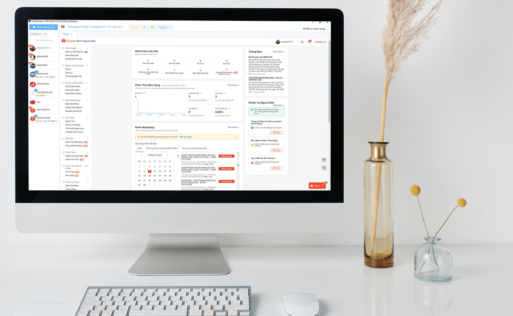
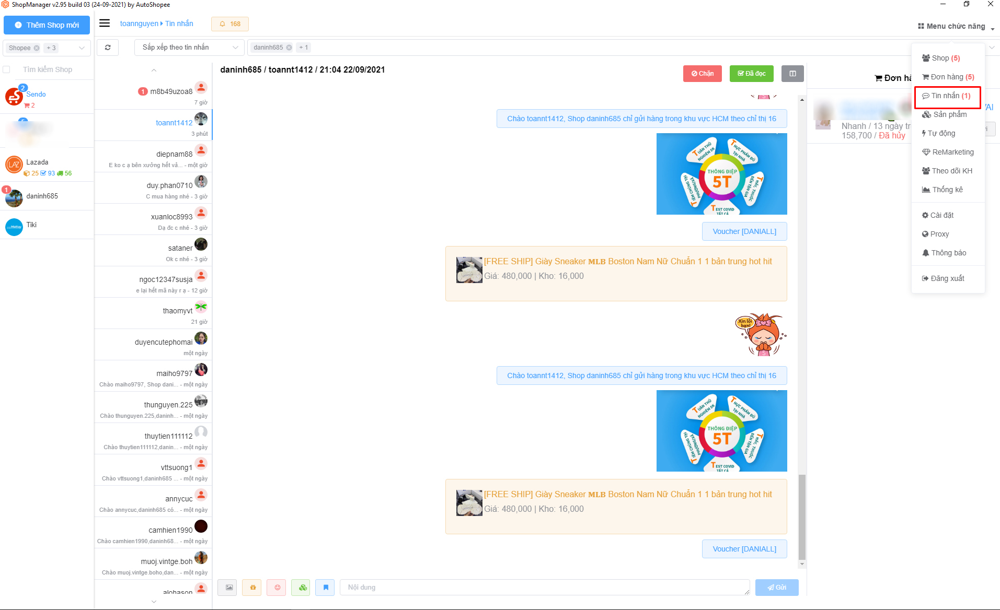

# 🏠 Trang chủ

<figure><figcaption>
Shop Manager — tất cả shop của bạn trên cùng một màn hình
</figcaption></figure>

## AutoShopee là gì?

**AutoShopee** là giải pháp **All-In-One** giúp người bán quản lý nhiều shop trên nhiều sàn thương mại điện tử — **Shopee · TikTok Shop · Lazada** — chỉ trong một nền tảng. Một màn hình cho tất cả shop: đơn hàng, tin nhắn, sản phẩm, doanh thu, Flash Sale và marketing.

Sản phẩm của **Công ty Cổ phần Tập đoàn MediaSoft**, hoạt động từ năm 2018 và là **Đối tác chính thức của Shopee Open Platform** (Partner ID 2012256, danh mục ERP System).

| 100.000+ | 500M+ | 10M+ | 8+ |
| :-: | :-: | :-: | :-: |
| Seller đang dùng | Đơn hàng đã xử lý | Sản phẩm đã xử lý | Năm hoạt động |


Đây là **trang hướng dẫn sử dụng**. Nếu bạn đang tìm thông tin sản phẩm và bảng giá, xem [autoshopee.com](https://autoshopee.com) — còn đăng ký tài khoản tại [autoshopee.com/auth/register](https://autoshopee.com/auth/register) (dùng thử miễn phí 3 ngày, đầy đủ tính năng).


***

## 🧰 Hệ sinh thái AutoShopee có gì?

Năm công cụ, dùng chung **một tài khoản AutoShopee** — dùng riêng lẻ hay kết hợp đều được.

| Công cụ | Dùng để làm gì | Nền tảng |
| --- | --- | --- |
| 📗 **Shop Manager** | Phần mềm máy tính: gộp nhiều shop một màn hình, xử lý và in vận đơn hàng loạt, chat tập trung, đối soát, phân tích doanh thu | Windows · macOS — [tải về](https://shop-manager-app.autoshopee.com/) |
| 📒 **AutoShopee Kit** | Tiện ích trình duyệt: sao chép sản phẩm 1 click, tải ảnh và video không watermark, tạo Flash Sale, spy đối thủ, tải đánh giá | Chrome · Cốc Cốc · Edge · Brave · Firefox — [cài đặt](extension/cai-dat/) |
| 📙 **AutoShopee Web** | Sao chép sản phẩm hàng loạt Shopee sang TikTok Shop và Lazada, đồng bộ dữ liệu, thông báo đơn hàng | Trình duyệt — [autoshopee.com](https://autoshopee.com) |
| 📱 **ScanQr** | Biến điện thoại thành máy quét QR, dữ liệu hiện ngay trên máy tính — kiểm đúng đơn trước khi đóng gói | Miễn phí, không cần cài đặt |
| 📊 **AutoShopee Seller** | Bộ 8 công cụ tính giá bán, phí sàn, điểm hoà vốn, tạo khung ảnh sản phẩm và đối soát doanh thu | Miễn phí, chạy trên trình duyệt |

<figure><figcaption>
Đơn hàng của mọi shop, mọi sàn — gom về một danh sách
</figcaption></figure>

***

## 🚀 Người mới bắt đầu từ đâu?

Toàn bộ lộ trình mất khoảng **30–60 phút**, từ lúc đăng ký đến khi chạy được Flash Sale đầu tiên.

| # | Việc cần làm | Hướng dẫn |
| :-: | --- | --- |
| 1 | Đăng ký tài khoản AutoShopee | [autoshopee.com/auth/register](https://autoshopee.com/auth/register) |
| 2 | Chọn gói và thanh toán | [Bảng giá](https://autoshopee.com/bang-gia) · [Cổng thanh toán](https://payment.autoshopee.com) |
| 3 | Tải và cài Shop Manager | [shop-manager-app.autoshopee.com](https://shop-manager-app.autoshopee.com/) |
| 4 | Cài Extension AutoShopee Kit | [Hướng dẫn cài đặt](extension/cai-dat/) |
| 5 | Tắt OTP Shopee (lấy mã SPC\_F) | [Tắt OTP](xu-ly-loi/shopee/tat-otp.md) |
| 6 | Thêm shop đầu tiên vào phần mềm | [Thêm Shop](shopmanager/quan-ly/them-shop.md) |
| 7 | Sao chép thử vài sản phẩm | [Sao chép đa sàn](autoshopee/sao-chep-da-san/) |
| 8 | Bật thông báo đơn hàng | [Thông báo đơn hàng](autoshopee/thong-bao-don-hang/) |
| 9 | Tạo Flash Sale đầu tiên | [Tạo FlashSale](extension/su-dung/tao-flashsale/) |


**Bước 5 là bước hay bị bỏ sót nhất.** Từ 10/06/2022 Shopee không cho shop tự tắt OTP, bạn phải lấy mã **SPC\_F** thay thế. Chưa có mã này thì bước 6 sẽ thêm shop không thành công.


***

## 🧭 Tài liệu theo sản phẩm

### 📗 Shop Manager — phần mềm trên máy tính

Trung tâm điều khiển đa shop, đa sàn cho Windows và macOS: gộp nhiều shop trên một màn hình, xử lý và in vận đơn hàng loạt, chat tập trung, đối soát, phân tích doanh thu theo thời gian thực.

<figure><figcaption>
Chat tập trung — trả lời khách của mọi shop trong một cửa sổ
</figcaption></figure>


[quan-ly](shopmanager/quan-ly/)



[san-pham](shopmanager/san-pham/)



[don-hang](shopmanager/don-hang/)



[tu-dong](shopmanager/tu-dong/)



[nang-cao](shopmanager/nang-cao/)



[shop-admin](shopmanager/shop-admin/)


### 📒 AutoShopee Kit — tiện ích trình duyệt

Chạy trực tiếp trên trang Shopee, TikTok Shop và Lazada: sao chép sản phẩm 1 click, tải ảnh và video không watermark, tạo Flash Sale hàng loạt, spy đối thủ, tải đánh giá, in đơn kèm chữ ký. Hỗ trợ Chrome, Cốc Cốc, Edge, Brave và Firefox.


[cai-dat](extension/cai-dat/)



[su-dung](extension/su-dung/)


### 📙 AutoShopee — nền tảng web

Sao chép sản phẩm hàng loạt từ Shopee sang TikTok Shop và Lazada, đồng bộ dữ liệu sản phẩm và nhận thông báo đơn hàng qua Telegram.


[shopee](autoshopee/shopee/)



[sao-chep-da-san](autoshopee/sao-chep-da-san/)



[thong-bao-don-hang](autoshopee/thong-bao-don-hang/)


***

## ❌ Gặp lỗi khi sử dụng?

Các lỗi thường gặp nhất: Shopee bắt OTP hoặc Captcha, thêm shop không thành công, sao chép sản phẩm bị lỗi, macOS báo "Unidentified Developer", Windows báo "Maximum call stack size".


[shopee](xu-ly-loi/shopee/)



[windows-macos](xu-ly-loi/windows-macos/)


***

## 📞 Cần hỗ trợ trực tiếp?

Đội ngũ hỗ trợ làm việc **Thứ 2 – Thứ 6, 08:00 – 18:00** (trừ ngày lễ).

* 📞 **Hotline**: 0904.628.850 – 0907.298.768
* 💬 **Zalo**: [zalo.me/2141564390855067259](https://zalo.me/2141564390855067259)
* 📧 **Email**: autoshopeevn@gmail.com

<figure><figcaption>
Quét mã QR để chat với AutoShopee trên Zalo
</figcaption></figure>


[lien-he.md](lien-he.md)

