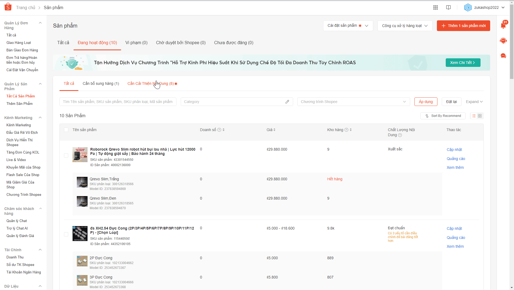
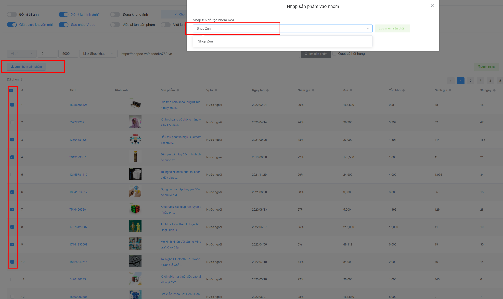
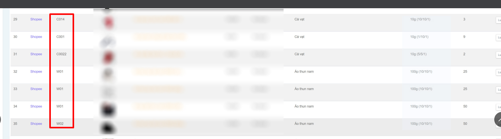

# 🎩 Đồng bộ dữ liệu sản phẩm


**Từ ngày 01/11/2025**, Shopee **ngừng cho phép truy cập dữ liệu tồn kho sản phẩm qua API**.

**Nếu bạn sao chép sản phẩm từ chính shop của mình** (bạn là **chủ shop đó**):\
👉 Bạn vẫn có thể **xuất file Excel từ Shopee** và **tải lên hệ thống** để đồng bộ các thông tin **tồn kho, SKU, kích thước và cân nặng**.

**Nếu bạn sao chép sản phẩm từ shop khác** (không thuộc quyền sở hữu của bạn):\
⚠️ Hiện tại **không thể đồng bộ tồn kho** hoặc **cập nhật cân nặng, kích thước thực tế** cho những sản phẩm này.


## 1) Tải Excel dữ liệu sản phẩm

Đăng nhập vào Shop gốc > Chọn cập nhật hàng loạt

<figure><figcaption></figcaption></figure>

* **Thông tin bán hàng** đồng bộ SKU phân loại và tồn kho thực tế
* **Thông tin vận chuyển** đồng bộ cân nặng, dài rộng và cao

<figure><figcaption>
Xuất Excel
</figcaption></figure>

<figure><figcaption></figcaption></figure>

## 2) Cập nhật lên hệ thống

Truy cập vào link sau => [https://autoshopee.com/public/shopee/productSync](https://autoshopee.com/public/shopee/productSync)

Dán link Shop gốc vào của bạn vào

<figure><figcaption></figcaption></figure>

Tải lên 2 file "Thông tin vận chuyển" và "Thông tin báng hàng" bạn vừa tải ở bước 1

<figure><figcaption></figcaption></figure>

Kết quả hiển thị như thế này là thành công

<figure><figcaption></figcaption></figure>

## 3) Nhập sản phẩm vào Kho

Bạn nhập sản phẩm vào Kho như bình thường phần mềm sẽ tự động theo đúng dữ liệu bạn đã cập nhật

<figure><figcaption></figcaption></figure>


Nếu bạn có sản phẩm mới đăng lên Shop bạn cần cập nhật lại SKU và cân nặng mới nhé

