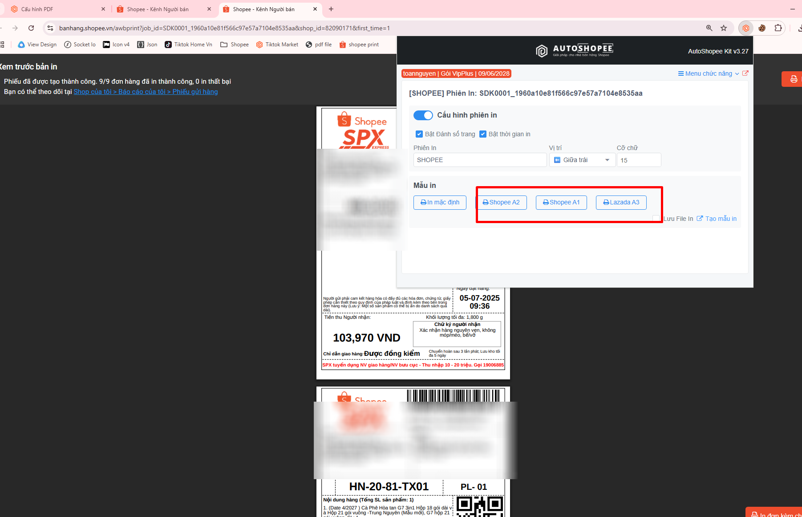
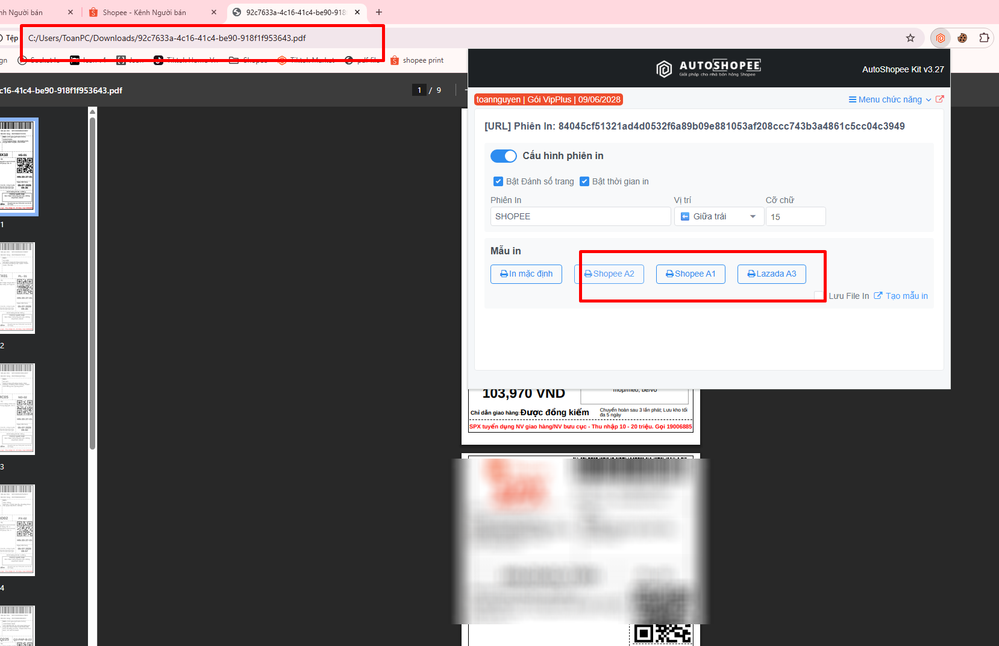
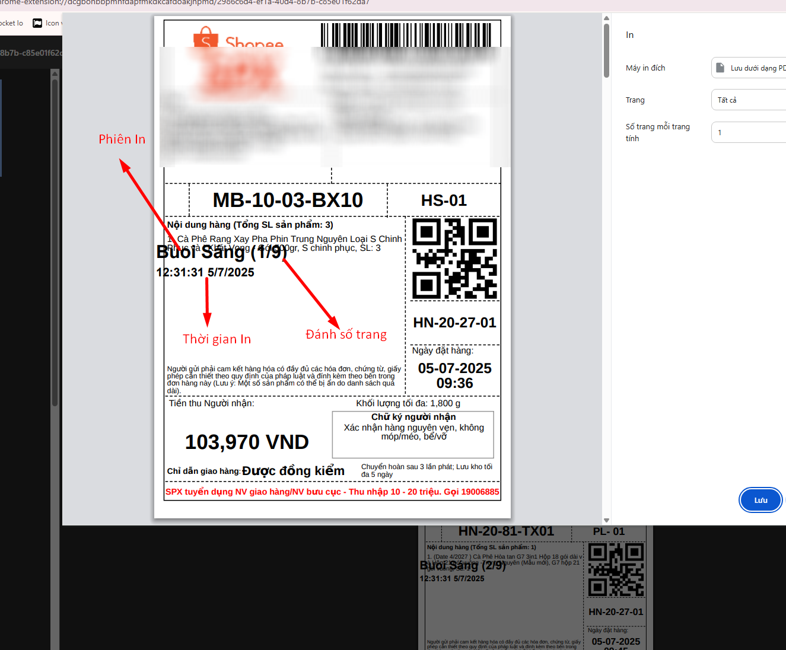

# 🖨️ In đơn kèm chữ ký

<figure><figcaption></figcaption></figure>

Ứng dụng giúp bạn thêm các "Ghi chú" quan trọng lên FIle in đơn hỗ trợ các sàn Shopee Lazada TiktokShop

## 1) Tạo mẫu In đơn PDF&#x20;

Mở menu cấu hình bằng Icon gốc phản màn hình để

<figure><figcaption></figcaption></figure>

Đây là trang cấu hình

<figure><figcaption></figcaption></figure>

Bạn có thể thêm 2 định dạng vào vị trí mong muốn

* Dạng nội dung (text)&#x20;
* Dạng hình ảnh

<figure><figcaption></figcaption></figure>

File hình ảnh mẫu [https://drive.google.com/drive/u/0/folders/1btOrjBYtfLblWo6\_5IpttwYmKn69edqI](https://drive.google.com/drive/u/0/folders/1btOrjBYtfLblWo6_5IpttwYmKn69edqI)

<figure><figcaption></figcaption></figure>

Sau khi xong chọn lưu cấu hình. Bạn có thể lưu nhiều cấu hình in đơn khác nhau cho từng Shop khác nhau, cho từng Sàn khác nhau, hoặc cho từng đơn vị vận chuyển khác nhau

<figure><figcaption></figcaption></figure>

## 2) In đơn trên Shopee

Mở Icon gốc phải AutoShopee Kit để In và chọn mẫu muốn In

<figure><figcaption></figcaption></figure>

Đây là kết quả

<figure><figcaption></figcaption></figure>

## 3) In đơn trên Lazada

Tương tự giống Shopee

<figure><figcaption></figcaption></figure>

## 4) In đơn trên Tiktok

Tương tự giống Shopee

<figure><figcaption></figcaption></figure>

## 5) In trên một file Pdf bất kì

Ngoài ra bạn có thể In bất kì một file PDF nào đó


Trước tiên bạn cần cho phép Extension được phép đọc FIle PDF, theo hướng dẫn sau


<figure><figcaption></figcaption></figure>

<mark style="color:orange;">Bật "Cho phép truy cập vào các URL của Tệp"</mark>

<figure><figcaption></figcaption></figure>

Quay lại và In như bình thường

<figure><figcaption></figcaption></figure>

## \*) Phiên In đơn

Phiên In giúp bạn dễ dàng phân file In cho "Nhân viên" hoặc bạn muốn đánh dấu file In đơn

<figure><figcaption></figcaption></figure>

<figure><figcaption></figcaption></figure>
