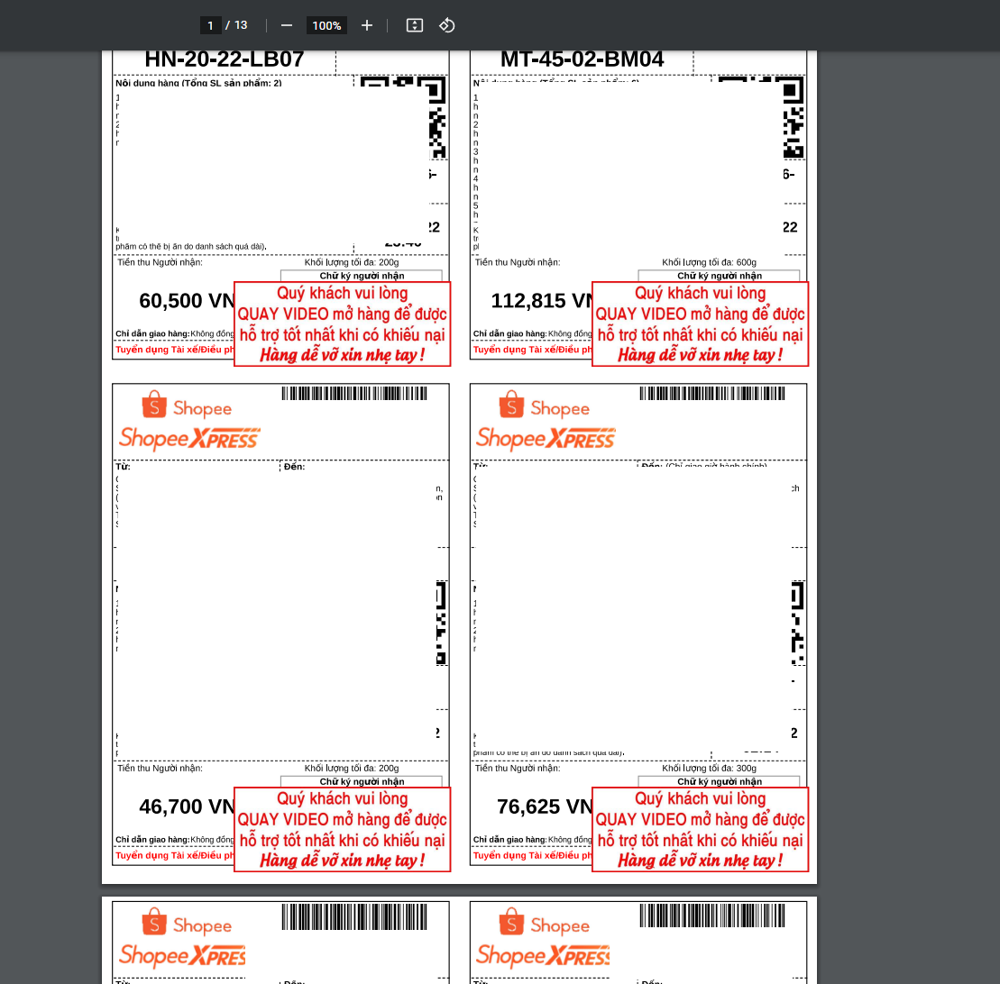

# In đơn kèm con dấu

Đối vơi một số bạn bán sản phẩm nhạy cảm, hoặc bạn muốn lưu ý một thông tin nào đó trên đơn hàng một cách tự động

<figure><figcaption></figcaption></figure>

## 1) Cài đặt

<figure><figcaption>
Menu chức năng > tự động
</figcaption></figure>

<figure><figcaption>
Kích hoạt
</figcaption></figure>

## 2) Thêm chữ kí

Bạn có thể tự tạo riêng một nội dung cho mình hoặc sử dụng mẫu dưới đây


Mẫu chữ kí [https://drive.google.com/drive/folders/1btOrjBYtfLblWo6\_5IpttwYmKn69edqI](https://drive.google.com/drive/folders/1btOrjBYtfLblWo6\_5IpttwYmKn69edqI)


<figure><figcaption>
Một số mẫu
</figcaption></figure>

Chọn Tệp tải lên > Tải lên ảnh chữ kí bạn muốn

<figure><figcaption>
Chọn tệp tải lên
</figcaption></figure>

Điều chỉnh thông số phù hợp với từng mẫu

<figure><figcaption>
Chỉnh thông số
</figcaption></figure>

Đừng quên lưu lại cài đặt

<figure><figcaption></figcaption></figure>

## 3) In đơn

<figure><figcaption></figcaption></figure>

<figure><figcaption>
Và đây là kết quả
</figcaption></figure>

## \*) Che tên sản phẩm

Một số sản phẩm nhạy cảm như BCS, đồ lót, các sản phẩm dành cho phụ nữ => Các bạn có thể sử dụng mẹo như sau

1. Chọn một hình ảnh ảnh bất kì (hoặc một bức ảnh trắng tinh)
2. Điều chỉnh vị trí của ảnh tới vị trí cần che tên

<figure><figcaption></figcaption></figure>
