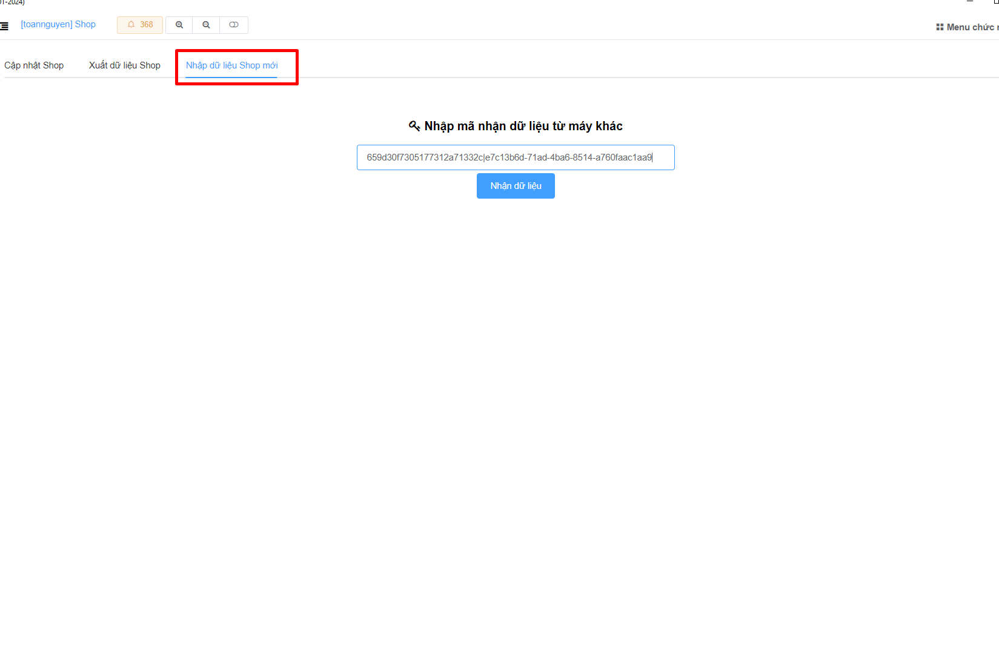

# Chuyển Shop

## 1) Xuất dữ liệu máy A

Đầu tiên bạn cần xuất dữ liệu các Shop

<figure><figcaption>
Menu > Chọn Shop
</figcaption></figure>

Chọn Shop bạn muốn Chuyển

<figure><figcaption>
Xuất dữ liệu
</figcaption></figure>

<figure><figcaption>
Copy lại mã Key này
</figcaption></figure>


Bạn Copy lại mã Key này và chuyển sang máy B


## 2) Chuyển dữ liệu sang máy B

Nhập Key vừa xuất ở máy A vào

<figure><figcaption>
Nhập Key
</figcaption></figure>

Chọn Shop muốn Thêm => Thêm lại Shop

<figure><figcaption></figcaption></figure>
